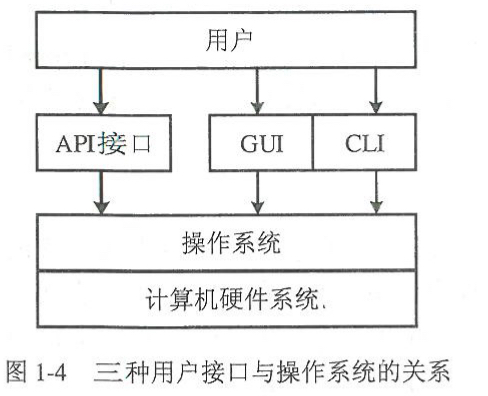
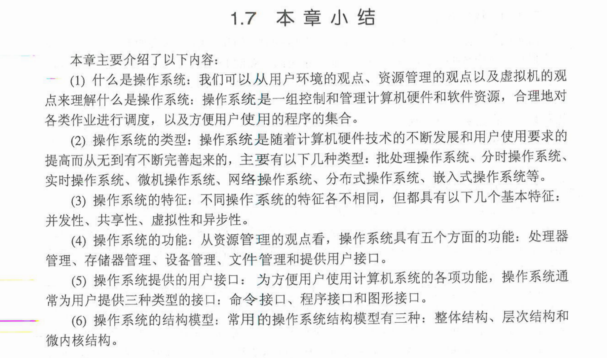

#  第一章-操作系统引论 

--------

   * [第一章-操作系统引论](#第一章-操作系统引论)
   * [1.1 什么是操作系统](#11-什么是操作系统)
         * [1.1.1 计算机系统](#111-计算机系统)
         * [1.1.2 操作系统的概念](#112-操作系统的概念)
   * [1.2 操作系统的发展与分类](#12-操作系统的发展与分类)
   * [1.3 操作系统的特征和功能](#13-操作系统的特征和功能)
         * [1.3.1操作系统的特征](#131操作系统的特征)
         * [1.3.2 操作系统的功能](#132-操作系统的功能)
   * [1.4操作系统用户接口](#14操作系统用户接口)
   * [1.5 操作系统内核结构](#15-操作系统内核结构)

--------

#  1.1 什么是操作系统
>###   1.1.1 计算机系统   
>1. 计算机硬件：CPU、存储器和各种输入输出。      
>2. 计算机软件:系统软件、支撑软件、应用软件。  
>&nbsp; 
>&nbsp;
>###  1.1.2 操作系统的概念
>1. 用户环境的观点:    
操作系统是用户与计算机硬件之间的接口。用户通过三种方式使用计算机：     
**1\:** 直接使用操作系统提供的键盘命令或Shell命令语言。    
**2\:** 利用鼠标点击窗口中的按钮、菜单等图标，以执行相应的应用程序。    
**3\:** 在应用程序中调用操作系统的内部功能模块，即系统调用接口。        
> &nbsp;     
>2. 资源管理的观点:       
关于操作系统描述的主要观点：把计算机看做系统资源的管理者。   
现代计算机资源通常包括：处理器、存储器、I/O设备和文件四类。    
操作系统的功能是对计算机的这些软、硬件资源进行控制、调度、分配和回收，解决系统中各种程序对资源使用请求的冲突，保证这些程序都能顺利完成运行。     
> &nbsp;   
>3. 虚拟机观点：    
操作系统是一组控制和管理计算机硬件与软件资源，合理地对各类作业进行调度，以及方便用户使用的程序的集合。    
>&nbsp;
>&nbsp;

# 1.2 操作系统的发展与分类   
>1. 手工操作阶段
>2. **批处理阶段**
>    - 单道批处理系统:
        在单道批处理系统中，设置了一个能完成作业自动转换工作的程序，该程序被称为监督程序，当操作员把一批作业叫哥系统后，就由监督程序控制这一批作业的自动运行。
>    - 多道批处理系统：  
多道运行程序（微观上串行）   
优点：资源利用率高，系统吞吐量大。    
缺点：作业的平均周转时间长，且无交互能力。
>3. **分时操作系统**    
特点：多路性、独立性、及时性和交互性。
>4. 实时操作系统  
特点：及时性和可靠性。交互性较弱。
>5. 微机操作系统
>6. 网络操作系统
>7. 分布式操作系统
>8. 嵌入式操作系统    
>&nbsp;
>&nbsp;

# 1.3 操作系统的特征和功能
>### 1.3.1操作系统的特征
>1. **并发性：**   
在多道程序环境下，指两个或多个事件在同一时间间隔内同时发生。（微观上是交替运行）并发的目的是改善系统资源的利用率和提高系统的吞吐量。
*程序本身是静态的代码，并发的是具体的进程。*  
>2. **共享性：**   
互斥共享|同时共享   
互斥共享指临界资源在一段时间内只能一个程序使用。  
同时共享指系统资源在允许在同一段时间内被多个程序同时访问。（同时指宏观上）   
>3. **虚拟性：**    
，，，
>4. **异步性：**
异步性又称为不确定性。    
在多道程序环境下，允许多个程序并发执行，到由于资源等因素限制，使得多个程序的运行顺序和每个程序的运行时间是不确定的，各程序的执行过程有“走走停停”的特点。
>&nbsp;
>### 1.3.2 操作系统的功能 
>1. 处理器管理
>2. 存储器管理
>3. 设备管理
>4. 文件管理
>5. 提供用户接口：  
命令接口CLI：操作系统向用户提供一组键盘操作命令。  
程序接口API：操作系统内核与应用程序之间的接口。    
图形接口GUI：方便用户使用操作系统而提供的图形化操作界面。   
>
>&nbsp;
>&nbsp;
# 1.4操作系统用户接口   
> - 命令接口CLI
> - 程序接口API
> - 图形接口GUI
>

   

# 1.5 操作系统内核结构
>1. 整体结构
>2. 层次结构
>3. 微内核结构
>&nbsp;     

&nbsp; 
&nbsp; 

  