#  第三章-进程管理
--------
- [3.1 进程的引入](#31-进程的引入)
    - [3.1.1 进程的并发执行及特征](#311-进程的并发执行及特征)
    - [3.1.2进程管理功能](#312进程管理功能)
- [3.2 进程的概念](#32-进程的概念)
    - [3.2.1 进程定义和特征](#321-进程定义和特征)
    - [3.2.2 进程状态及转换](#322-进程状态及转换)
    - [3.2.3 Linux进程状态解系](#323-linux进程状态解系)
    - [3.2.4 进程控制块PCB](#324-进程控制块pcb)
- [3.3 进程控制](#33-进程控制)
    - [3.3.1 进程创建](#331-进程创建)
    - [3.3.2 进程撤销](#332-进程撤销)
    - [3.3.3 进程阻塞与唤醒](#333-进程阻塞与唤醒)
    - [3.3.4 Liunx进程管理](#334-liunx进程管理)
- [3.4 进程同步](#34-进程同步)
    - [3.4.1 进程同步的基本概念](#341-进程同步的基本概念)
    - [3.4.2 进程同步机制及应用](#342-进程同步机制及应用)
    - [3.4.3 经典进程同步问题](#343-经典进程同步问题)
    - [3.4.4 管程机制](#344-管程机制)
    - [3.4.5 Linux同步机制解系](#345-linux同步机制解系)
- [3.5 进程调度](#35-进程调度)
    - [3.5.1 进程调度的基本概念](#351-进程调度的基本概念)
    - [3.5.2 进程调度算法](#352-进程调度算法)
    - [3.5.3 Linux调度算法解析](#353-linux调度算法解析)
- [3.6 进程通信](#36-进程通信)
    - [3.6.1 进程通信种类](#361-进程通信种类)
    - [3.6.2 消息缓冲队列通信机制](#362-消息缓冲队列通信机制)
    - [3.6.3 Linux进程通信机制](#363-linux进程通信机制)
- [3.7 进程死锁](#37-进程死锁)
    - [3.7.1 死锁的基本概念](#371-死锁的基本概念)
    - [3.7.2 预防死锁](#372-预防死锁)
    - [3.7.3 避免死锁](#373-避免死锁)
- [3.8 线程机制](#38-线程机制)
    - [3.3.1 线程的基本概念](#331-线程的基本概念)
    - [3.8.2 线程的实现机制](#382-线程的实现机制)
- [3.9 小结](#39-小结)
--------

#  3.1 进程的引入

>### 3.1.1 进程的并发执行及特征
>1. 程序的并发执行    
早期的单道程序系统，一次只能运行一个程序。现在的多道程序系统，共享资源，并发执行。提高了资源的利用率和系统的吞吐量。
>2. 程序并发执行特征    
>    * **间断性**:由于共享资源，导致一定时间内需要等待其他程序使用完正在使用的资源。
>    * **不可再现性**：共享资源会导致程序失去封闭性，是得程序的运行结果会受到其他程序的影响。（3.4节会解决此问题）
>3. 静态程序结构不支持并发    
一个静态的程序只能一次性的运行完毕，不能进行并发操作。因为没有保护现场。  
>&nbsp; 
>### 3.1.2进程管理功能
>1. 进程控制    
引入多道程序技术后，要并发运行程序：必须为程序创建一个或几个进程，并为之分配资源，最后回收资源。
>2. 进程互斥与同步   
在多道程序环境中，多个进程是异步运行的。但资源有限，系统需要对多个进程进行协调。
>3. 进程通信    
当多个进程互相配合完成任务的时候，需要进行进程间的通信。
>4. 调度   
后备队列中的作业需要经过调度才能进行执行：为其创建进程、分配资源、插入就绪队列……
>&nbsp;     
&nbsp; 

#  3.2 进程的概念
>### 3.2.1 进程定义和特征
>1. 进程的定义和特征
进程的定义：进程是具有一定独立功能的程序关于某个数据集合的一次运行过程，是系统进行资源分配和调度的一个独立单位。**系统资源调度的最小单位。**
    * 动态性：进程是程序的一次执行过程。有一定的生命周期。**动态性是进程最基本的特征。**
    * 并发性：多个进程在一段时间内同时运行。引入进程的目的是为了实现多道程序的并发运行。
    * 独立性：进程是一个独立运行的基本单位。
    * 异步性：进程是按照独立的、不可预知的速度向前推进。
>2. 进程映像    
包括：程序（段）、数据集、栈和PCB。
>3. 进程与程序的区别和联系
    * 程序是静态的、进程是动态的。
    * 进程是可以独立运行的、程序不能。（不能参与并发执行）
    * 进程有异步特征、程序没有。
    * 程序和进程并非一一对应。一个程序可以由多个进程共享，而一个进程在其运行过程中又可以顺序的执行多个程序。
>&nbsp; 
>### 3.2.2 进程状态及转换
>1. 进程的三种基本状态  
>    1. 就绪状态：   
    在就绪队列中，进程已经分配到了需要的资源，只需要或得处理器就可以立即执行。
>    2. 运行状态：    
    进程正在执行。
>    3. 阻塞状态：    
    正在执行的进程因等待某事件的发生而暂停（请求I/O设备、等待其他进程信号），其存在于阻塞队列中。
>    * 就绪->运行：就绪队列中的进程获取到了处理器，并布置运行现场后，便进入运行状态。
>    * 运行->就绪：在分时系统中，如果时间片用完，则进入就绪队列；在抢占调度方式中，如果有更高级的就绪进程到达，则重新进入就绪队列。
>    * 运行->阻塞：当前的进程因为要等待某事件的发生而无法继续运行。如：等待I/O操作的完成，或未能申请到所需的资源，或等待其他进程的信号。
>    * 阻塞->就绪：错与阻塞状态的进程，所等待的事件已经发生。
>       <div align=center>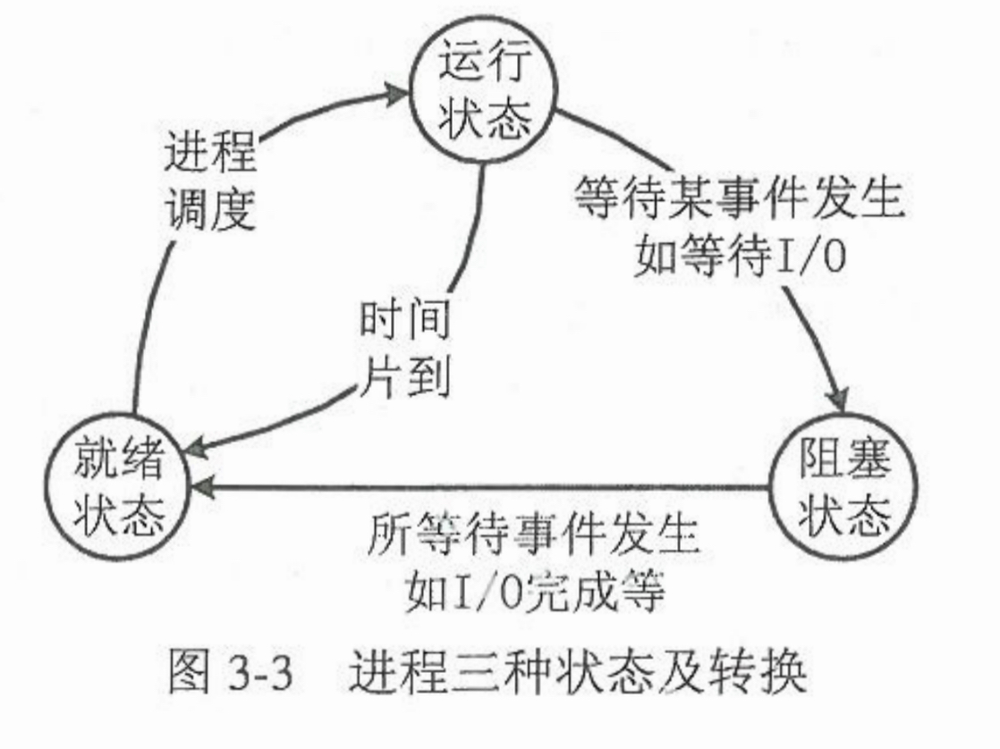</div>     
>2. 创建状态和终止状态    
>    * 创建状态：指正在被创建，但没加入就绪队列中的进程。
>    * 终止状态：当前进程完成自己的工作后正常结束，或者运行过程中出现了无法克制的错误而被异常终止。 
>###  3.2.3 Linux进程状态解系
>&nbsp; 
>### 3.2.4 进程控制块PCB    
>用于记录进程的相关信息，通常包括：  
>1. 进程标识符：  
>    * 进程标识符：每个进程独一无二的标识符。
>    * 用户标识符：每个进程属于的用户或用户组。以便资源共享。
>    * 家族关系：多个进程之间的关系，如父进程、兄弟进程、子进程等。
>2. 进程调度信息：  
>    * 进程状态：就绪、运行、阻塞等状态。
>    * 进程优先级：优先级高的可以先运行。
>    * 其他调度相关信息：通常与系统的调度算法有关，如进程等待时间、执行时间……
>    * 事件：进程能够继续执行前需等待的事件，即进程阻塞的原因。
>3. 进程现场信息：   
>    * 通用寄存器内容：又称为用户可见寄存器，用来传送和暂存数据、参与运算、保存运算结果。
>    * 指令计数器值：存放了进程下一条要执行的指令的地址。
>    * 程序状态字PSW：包含CPU运行状态信息，如条件码、中断允许/禁止标志、处理器特权级、任务嵌套标志等。
>    * 栈指针：占用于保存过程调用的参数及返回地址、系统调用的参数及调用地址以及为局部变量分配存储空间。
>4. 进程控制信息：
>    * 进程的程序和数据在内存或外存中的地址。
>    * 进程同步信息：进程运行过程中与其他进程之间发生的各种制约关系。
>    * 进程通信信息：记录进程运行过程中与其他进程之间发生的信息交换情况。
>    * 资源管理信息：描述进程执行过程中资源的占用情况。
>    * 链接指针：进程在队列中的位置。
>&nbsp;    
&nbsp; 

#  3.3 进程控制
>### 3.3.1 进程创建
>1. 进程图   
用于描述进程家族关系的有向树。图中A为祖先进程、、、
>       <div align=center>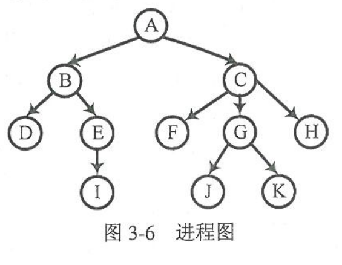</div> 
>2. 引起进程创建的典型事件
>    * 作业调度：
>    * 用户登录
>    * 提供特定服务
>    * 应用请求
>3. 进程创建原语    
包括以下几个步骤：
>    1. 为新进程申请一个尚未被使用的pid和一个空白的PCB。
>    2. 为新进程分配必要资源
>    3. 初始化新进程的PCB，填写相关信息。如pid、进程名、父进程标识、处理器初始状态、进程状态、进程优先级、进程要执行程序的入口地址、进程同步信息等。
>    1. 将进程状态置为就绪队列，并将进程放入就绪队列中。
>&nbsp; 
>### 3.3.2 进程撤销
>1. 引起进程撤销的典型事件：   
>    * 正常结束
>    * 异常终止
>    * 外界干预而撤销：程序员或操作系统干预；父进程请求；父进程被撤销。
>2. 进程撤销原语   
>    1. 根据被撤销进程的标识符（pid），从系统的PCB集合中找到该进程的PCB，读出其状态。若处于运行状态则立刻终止运行，并将系统调度标志置为“真”。
>    2. 若被撤销进程还有子进程，则应该进一步撤销其所有子进程，或为这些子进程临时指定新的父进程。
>    3. 回收被撤销进程所拥有的全部系统资源。
>    4. 将撤销进程的PCB从所在队列中移出。
>&nbsp; 
>### 3.3.3 进程阻塞与唤醒
>1. 引起阻塞和唤醒的典型事件   
    进程因为需要等待继续执行的条件或事件时，必须放弃CPU，进入阻塞状态
>    * 请求资源失败
>    * 等待某种操作完成
>    * 前驱进程尚未完成
>    * 进程无新工作可做
>2. 进程阻塞原语   
进程主动调用阻塞原语将自己阻塞起来。工作包括：立即停止该进程的执行，保存其CPU现场信息到PCB中，并将PCB中的状态改为“阻塞”，然后插入阻塞队列中。
>3. 进程唤醒    
由相关进程调用唤醒原语将其唤醒。唤醒原语首先要确定要唤醒的进程：查找该事件的阻塞队列，或者唤醒队首进程，或者唤醒指定进程，不同的操作系统机制不同。然后被唤醒的进程的PCB从所在的阻塞队列中移出，并将其PCB中的状态改为“就绪”，最后插入到就绪队列中。
>&nbsp; 
>### 3.3.4 Liunx进程管理
>&nbsp;    

&nbsp; 
#  3.4 进程同步
>### 3.4.1 进程同步的基本概念
>1. 并发进程间的间接制约关系与进程互斥
>    * 临界资源：    
    一些资源或者变量在一定时刻只能一个进程使用。
>    * **临界区**：    
    每个进程中访问临界资源的那段代码称为临界区。进程若使用临界资源需要检测当前临界资源是否空闲。
>    * 同步机制应遵循的原则：    
>        - 空闲让进：当没有进程处于临界区时，临界资源空闲，允许请求使用。
>        - 忙则等待：当已有进程处于临界区，临界资源忙碌，其他试图使用临界资源的进程等待。
>        - 有限等待：保证申请的访问能在有限的时间等待后进入自己的临界区。
>        - 让权等待：当进程不能进入临界区时，应立即释放CPU，以免CPU陷入“忙等”状态。
>2. 并发进程间的直接制约关系与进程同步
相互合作的进程在某些关键点上相互等待和互通信息。    
>&nbsp; 
>### 3.4.2 进程同步机制及应用
>1. 利用硬件方法解决进程互斥问题
>    * 禁止中断：   
    直接禁止CPU中断（一直运行当前进程）。缺点：系统风险大；多CPU时没用。
>    * 利用专用机器指令解决进程互斥问题：
>        - **TSL指令**：        
> 如图3-11所示。原理：先读出指定地址中的值，并赋予一非零新值，最后返回该地址中的旧值。CPU在执行TSL指令时会封锁内存总线，防止其他CPU访问内存。
        <div align=center>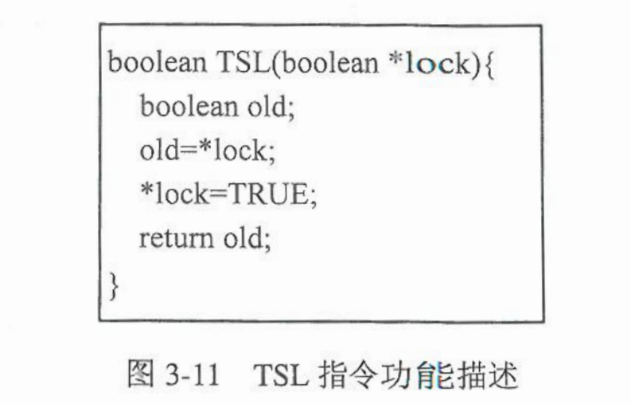</div> 
>   在使用TSL指令时，先声明一个全局Bool变量lock，TRUE表示资源被占用，FALSE表示资源空闲。然后如图3-12。
       <div align=center>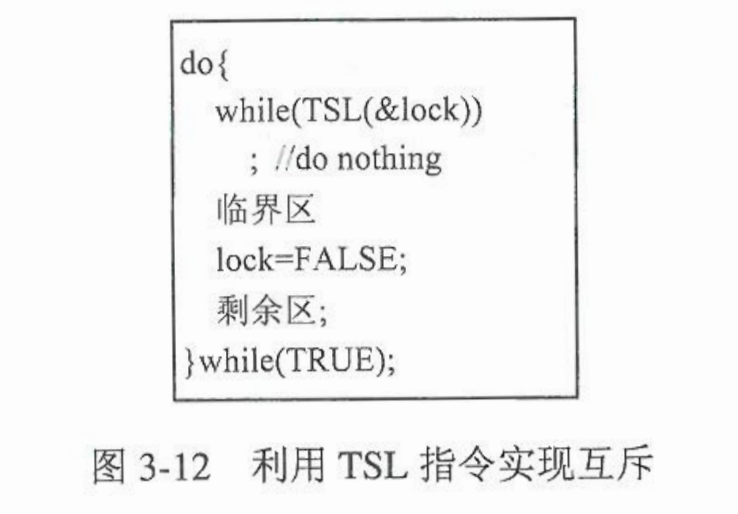</div>     
>       - **Swap指令**：    
>Swap指令的功能是交换两个字的内容。功能如图3-13所示： 
       <div align=center>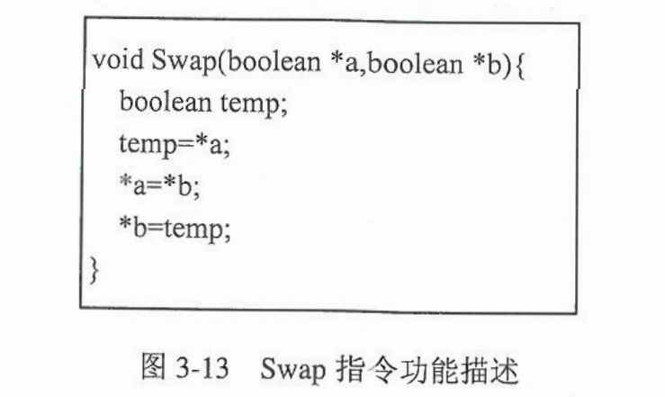</div>    
>在使用Swap指令时，为每个临界资源设置一个全局布尔变量lock，初值为FALSE，表示资源空闲。在每个进程中设置一个局部布尔key，用于与lock交换信息。进入临界区之前先利用Swap指令交换lock和key的内容，然后检测key的值，若为FALSE，则表示临界资源空闲。
       <div align=center>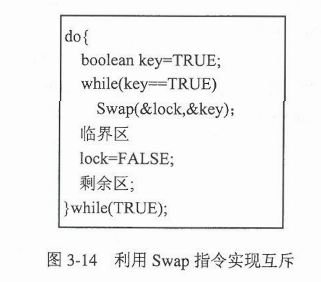</div> 
>2. 利用软件方法解决进程互斥问题   
>    - 不正确的算法：    
>       * 严格交替算法：设置一个共享变量turn，=0时表示P0可以进入临界区，=1时表示P1可以进入临界区。
       <div align=center>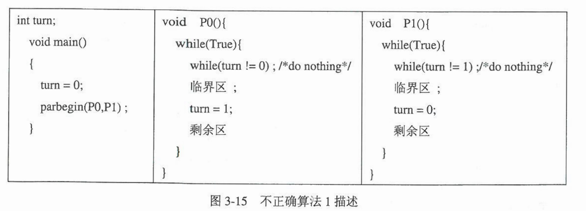</div> 
>       * 不正确算法2：（将上一个算法改进，但书上并未给出分析）
       <div align=center>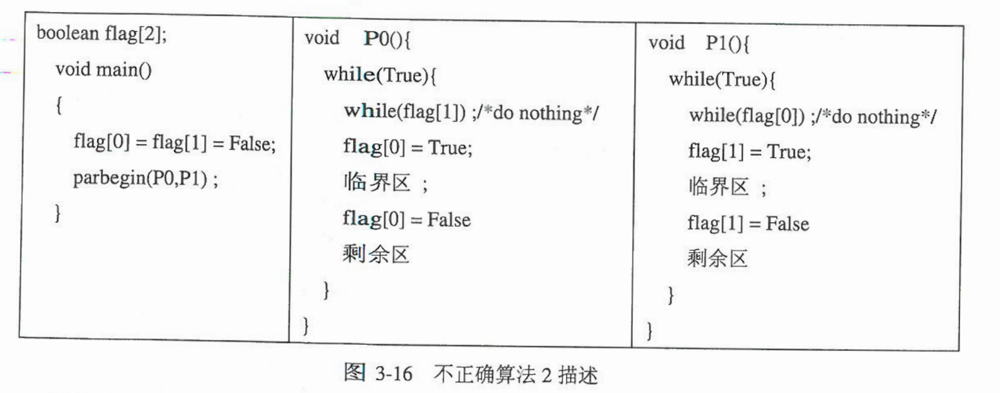</div> 
>    - Peterson算法：    
    设置两个共享变量：布尔数组flag[2]，表示进程是否希望进入临界区，初始值均为false；整型变量turn用于标识当前优先允许那个进程进入，turn=0则P0优先进入。算法描述如图3-17：
       <div align=center>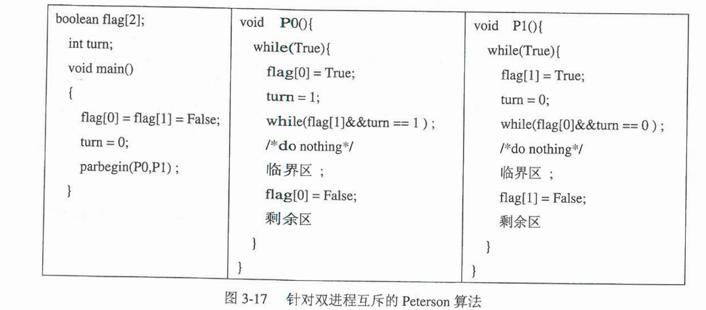</div>
>    - 面包店算法：   
    在进入前区号，按号码由小到大进入，若号码相同则按名字字典排序。choosing[i]表示进程是否在取号，初值为FALSE；number[i]记录取到的号码。细节如图3-18所示：
       <div align=center>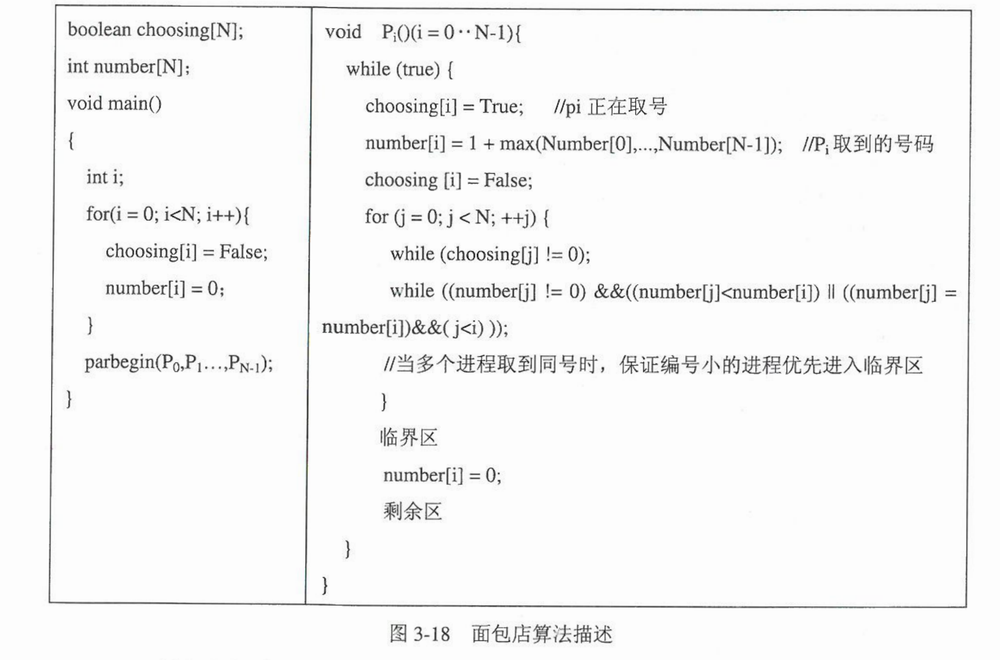</div> 
>3. 利用死锁机制解决进程互斥问题   
在锁机制中，需要为每个临界资源设置一个把锁w，值为0表示资源可用，1表示被占用。任一进程进入时需要执行关锁操作，成功后进入临界区，否则等待锁开。退出临界区时需要开锁。
>4. 利用信号量机制解决进程互斥与同步问题
>    * 整型信号量机制：
    一个共享的整型变量，包括三个操作：
>        - 初始化，一个信号量初始化为非负整数，表示对应资源可用数量。
>        - **P/V原语操作**：P操作为down()/wait(),V操作为up()/signal()。wait()先测试信号量S的值，若S<=0，则重复测试。否则S-1，进程继续执行，表示进程申请到了临界资源；signal()则对S+1，表示释放临界资源。
>        - 其P/V独立的操作是不可中断的。（违背了“让权等待”原则）
>    * 记录型信号量机制：   
    一种结构体类型信号量：一个整型变量表示信号量的值；一个指向对应阻塞队列的指针。具体操作如图3-22：
       <div align=center>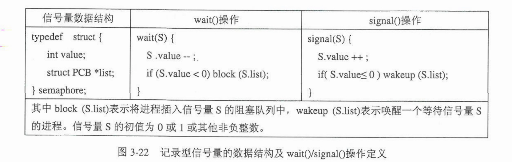</div>
    wait(S):将信号量-1，若结果大于等于0，则进程继续；若结果小于0，则进程阻塞，并插入到信号量S的阻塞队列中，然后转去调度其他进程。
    signal(S)：将信号量S+1，若结果大有0，则进程继续；若结果小于0，则从信号量S在阻塞队列中唤醒一个进程。
>    * 信号量集机制：
  之后补充
>    * 利用信号量机制实现进程的互斥：
>    * 利用信号量机制实现进程的同步：
>&nbsp; 
>### 3.4.3 经典进程同步问题
>1. **生产者-消费者问题**：   
   问题描述：   
   &emsp;&emsp;假定系统中有M个生产者和N个消费者，他们共享一个具有K个缓冲区的循环缓冲池。生产者不断生产，将产品放入缓存池，消费者从缓存池中取出产品。规定：消费者不能从空的缓冲池中取东西，生产者不能向满的缓冲区放东西。   
   问题分析：   
   &emsp;&emsp;用一个数组buffer[k]表示具有k个缓冲区的缓冲池，输入指针in指示下一个可投放产品的缓冲区，当生产者放入一个产品时，in+1；输出指针out指示下一个可以取走的缓冲区，当消费者取走一个产品后，out+1。由于缓存区可循环使用，因此两个指针实际应该表示未in=(in+1) mod k;out=(out+1) mod k。设置互斥信号量mutex，初始值为1，；设置资源信号量empty和full分别表示缓冲池中空缓冲区和满缓冲区的数量，初值为“K”和“0”。若想向缓冲池中放产品，需要：缓冲池中有空缓冲区；缓冲池当前状态空闲。   
   *注意*：    
>      * 在每个进程中互斥信号量mutex的wait()和signal()必须成对出现。
>       * 对资源信号量empty和full的wait()和signal()也必须成对出现，但分别处于不同的进程中。
>       * 在每个进程中的多个wait()顺序不能反。   
算法描述如下：    
>    ``` C
>    semaphore mutex;
>    semaphore empty,full;
>    buffer[k]:array of item;
>    int in,out;
>
>    void main() {
>        in=out=0;
>        mutex=1;
>        empty =k;
>        full =0;
>        parbegin(Producer-i,Consumer-j);
>    }
>
>    void Producer-i (i=1,2,,,m){
>        do{
>            produce an item nextp;
>            wait(empty); 
>            wait(mutex);
>            buffer(in) = nextp;
>            in= (in +1) mod k;
>            signal(mutex);
>            signal(full);
>        }while (1);
>    }
>
>    void Consumer-j (j=1,2,,,n){
>        do{
>            wait(full);
>            wait(mutex);
>            nextc = buffer(out);
>            out = (out +1) mod k;
>            signal(mutex);
>            signal(empty);
>            consume the item in nextc;
>        }while (1);
>    }
>    ```
> 
>2. **哲学家进餐问题**：    
    问题描述：   
    &emsp;&emsp;五人围坐在圆桌前吃饭，桌上只有五只碗筷，他们交替思考和吃饭。只有左右两只筷子都拿到才吃饭。  
    问题分析：   
    &emsp;&emsp;五只筷子为临界资源，为实现筷子的互斥使用，可为每只筷子设置一个互斥信号量，初值为1，只用一个信号量数组表示。对每个哲学家从0-4编号，筷子的信号量也从0-4标号。且与哲学家编号相同的筷子在该哲学家的左侧。一种解决思路：每个哲学家都先取其左侧的筷子，成功后再取右侧的筷子，取到后进餐。用完后释放。   
    **注意**：若哲学家同时吃饭，则会造成死锁。解决思路：   
>    * 最多允许四个哲学家同时拿筷子。
>    * 当两侧的筷子都可用时才拿起。
>    * 规定奇数哲学家先取左筷子，偶数哲学家先去右筷子。
    算法描述：
>```C
>semaphore chop[5];
>void main(){
>   chop[5]={1,1,1,1,1};
>   parbegin(Philosopher(i)(i=0...4));
>}
>
>void Philosopher(i){
>   do{
>       thinking;
>       wait(chop[i]);
>       wait(chop[i+1]mod5);
>       eating;
>       signal(chop[i]);
>       singnal(chop[i+1]mod5);
>   while(1);
>}
>```
>
>3. **读者-写者问题**：   
    问题描述：   
    &emsp;&emsp;系统有多个进程共享一个数据区（一个文件、一块内存、一组寄存器），Reader进程只能读数据，Writer进程只能写数据。进程必须满足：Reader可以同时读取；Writer只能单个写入；如果Writer正在写，则Reader不能读。   
    问题分析：    
    &emsp;&emsp;设置一个互斥信号量Wmutex，初值为1，设置整型变量ReadCount表示正在读的进程数目。若Reader想读，则当ReadCount的值>0，就直接读；如果ReadCount=0，则执行wait(Wmutex)检查有无Writer在写入。若wait成功，则ReadCount+1，执行完后ReadCount-1。   
    **注意**：
    该算法隐含着“读者优先”，可能会造成写者饥饿。   
    算法描述：
>```C
>semaphore Wmutex;
>semaphore Rmutex;
>int ReadCount;
>void main(){
>   ReadCount=0;
>   Wmutex=1;
>   Rmutex=1;
>   Parbegin(Reader-i,Writer-j);
>}
>
>void Reader-i(){
>   do{
>       wait(Rmutex);
>       if(ReadCount==9){
>           wait(Wmutex);
>       }
>       ReadCount++;
>       signal(Rmutex);
>       Reading;
>       wait(Rmutex);
>       ReadCount--;
>       if(ReadCount==0){
>           signal(Wmutex);
>       }
>       signal(Rmutex);
>   }while(1);
>}
>
>void Writer-j(){
>   do{
>       wait(Wmutex);
>       Writing;
>       signal(Wmutex);
>   }while(1);
>}
>
>    ```
> 
>4. **理发师问题**
>&nbsp; 
>### 3.4.4 管程机制
>1. 管程定义   
&emsp;&emsp;是一种需要编译器支持的进程同步机制。“一个管程定义了一个数据结构和能为并发进程所执行的一组操作，这组操作能同步进程和改变进程中的数据。”管程是一个软件模块，由四部分组成：    
>    * 管程名字。
>    * 局部于管程的共享数据结构的说明。
>    * 对该数据结构进行操作的一组过程，每个过程完成对上述数据结构的某种操作。
>    * 对于管程的共享数据结构进行初始化的代码。    
> 
>    **管程特性**：
>    - 局部于管程的数据结构只能被管程内的过程访问，而管程内的过程也只能访问该管程内部的数据结构。
>    - 一个进程若想访问管程内的数据结构（共享资源），只能通过管程内的某个过程实现间接访问。
>    - 任一时刻，管程中只能有一个活跃进程，即只能有一个进程在管程中执行管程的某个过程，其他任何调用管程的进程都被阻塞。
>2. 条件变量   
    &emsp;&emsp;生产者-消费者问题中，如果某时刻生产者进入管程，缓存池满了，但生产者不能立即释放管程，会让系统进入死锁。所以提出了“条件变量”的概念。用于实现进程间的同步关系。  
    &emsp;&emsp;当一个进程希望进入管程访问共享资源时，金额调用管程内的某一过程，若此时有其他进程在管程中执行，则该进程将被阻塞到管程中的“等待进入队列”，知道其他进程离开管程时将其唤醒；否则课直接进入管程执行。进入管程后若继续执行的条件满足，则可顺利完成对共享资源的访问；否则调用c.wait()将自己阻塞到条件c的等待队列上，并使管程可用，待条件满足后由其他进程将其唤醒。如图3-28：
>       <div align=center>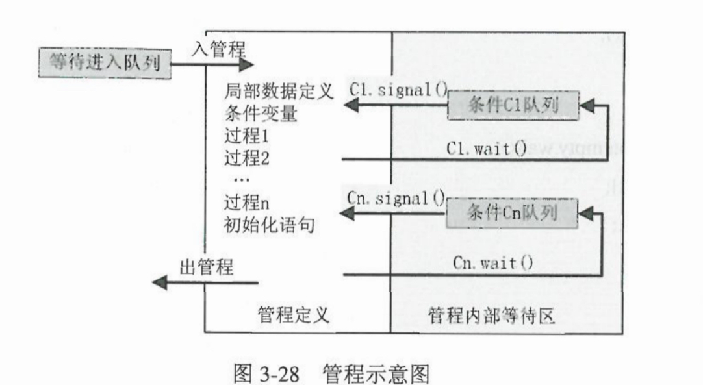</div> 
>3. 利用管程机制解决生产者-消费者问题   
>    首先建立一个名为PC的管程，包含：   
>    - 共享数据结构：生产者和消费者之间交换信息的循环缓冲池buffer[k]，生产者投放产品的缓冲区指针in，消费者的out，缓冲池产品个数count。
>    - 两个过程：生产过程put(),消费过程get()。
>    - 两个条件变量：生产者投放条件notfull(),消费者提取条件notempty()。   
>管程定义如图3-29，算法描述如图3-30：
><center class="half"><!-- 两图片并列显示： -->
>    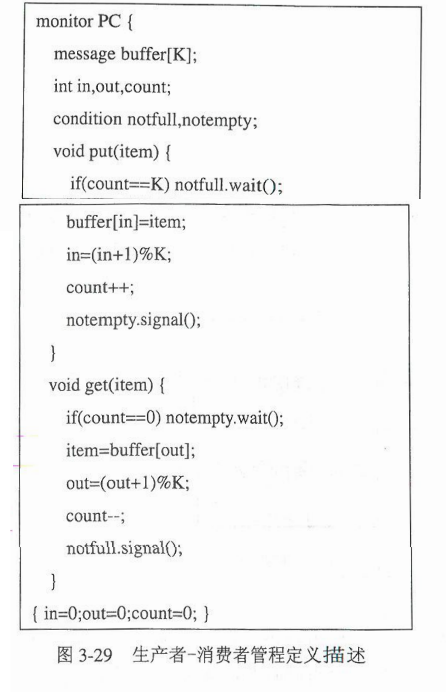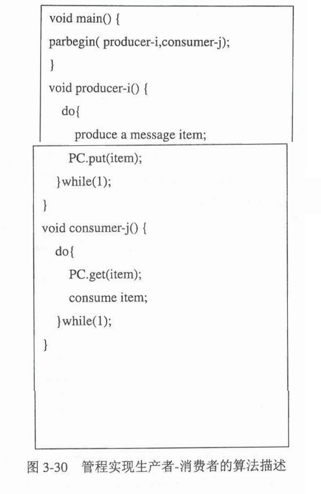
></center>
>&nbsp; 
>### 3.4.5 Linux同步机制解系
>
>&nbsp; 
&nbsp; 
#  3.5 进程调度
>### 3.5.1 进程调度的基本概念
>1. 调度的层次
>    - 高级调度：  
    又称作业调度或长程调度。其任务是将外存上的后备队列中若干作业调入内存，为其创建进程、分配资源。通常几分钟或几小时运行一次。
    在批处理系统中，作业提交后先进入外存上的后备队列，因此需要作业调度将他们分批装入内存；分时系统中，为了能及时响应，用户通过键盘输入的命令和数据通常直接送入内存；实时系统中，通常不需要作业调度
>    - 低级调度：  
    又称进程调度或短程调度。其任务是决定就绪队列中哪个进程获得处理器，然后分派程序把处理器分配给该进程，并为它恢复运行现场，并让其运行。通常十几毫秒运行一次。
>    - 中级调度：    
    又称中程调度或**对换调度**。引入中级调度是为了提高内存利用率和系统吞吐量。
    当内存紧张时，将暂时不能运行的进程换出到外存上，回收内存空间，此时进程为挂起状态；内存充足时，将具备运行条件的进程换入到内存中。
>2. 进程调度功能
>    - 排队程序：为方便调度程序快速找到下一个运行的进程，将系统中所有就绪进程按照一定策略组织成一个或多个队列。
>    - 分派程序：负责将进程调度程序所选定的待运行进程从就绪队列移出，将其状态改为“运行”，并调用上下文切换程序完成CPU控制权的转移，运行新的进程。
>    - 上下文切换程序：负责在CPU切换过程中，保存被移出进程的所有CPU寄存器内容到PCB或堆栈中，恢复新选中进程的CPU运行环境信息。
>3. 进程调度方式
>    - 非抢占式：
    优点：实现简单、系统开销小。缺点：不能保证紧迫任务得到及时处理。
>    - 抢占式：  
    按照一定的原则抢占CPU，（实时系统中优先级原则、分时系统中时间片原则、进程还需的运行时间原则）
>4. 进程调度时机   
    原因：1）当前进程结束。2）抢占调度的支持。   
>    - 当前进程结束或者因错误被终止。
>    - 因等待资源转变为阻塞状态。
>    - 分时系统中的时间片用完。
>    - 采用优先级抢占，就绪队列中出现优先级更高的进程。
>    - 系统完成系统调用或中断处理后，在返回到用户态前，通常会产生一次调度时机。
>5. 选择进程调度方式及调度算法应考虑的因素
>    - **系统设计目标：** 批处理系统应提高资源利用率、增加系统吞吐量以及缩短作业的平均周转时间；交互式系统应及时响应各用户的请求，让它们获得均衡的响应时间；实时系统必须保证各任务能得到及时、可靠的处理、、、
>    - **调度的公平性：** 一方面考虑进程的优先级；另一方面应使每个进程相对公平的使用资源。
>    - **资源的均衡利用：** 使系统各类资源得到充分、均衡的利用，以提高系统的资源利用率。
>    - **合理的系统开销：** 进程调度时的调度算法以及确定下一个运行进程，CPU切换时保存和恢复上下文信息，两者都会给系统带来额外的开销。
>6. 调度性能的评价指标
>    - CPU利用率
>    - 系统吞吐量
>    - 周转时间和待权周转时间
>    - 相应时间
>    - 对截止时间的保证
>&nbsp; 
>### 3.5.2 进程调度算法
>    带权周转时间=周转时间/要执行的时间。
>1. 先来先服务算法(FCFS):   
    优点：实现简单。
    问题：利于长作业，不利于短作业。非抢占算法，不能保证紧迫的任务及时处理。
>2. 短作业优先算法(SJF):    
    相较于FCFS算法，SJF算法能提高系统的吞吐量，降低平均周转时间和平均带权周转时间。   
    问题：实现上困难，难以判断进程（作业）运行时间；不公平，对于长作业非常不利；没有考虑任务的紧迫程度。
>3. 高响应比优先调度算法(HRRF)：
    响应比=$\frac{要求服务时间+等待时间}{要求服务时间}$
    高相应比对作业调度和进程调度都是用，但更多用于作业调度。
    不足：每次调度需要计算所有作业（进程）的响应比。
>4. 优先级调度算法：
>    - 非抢占式优先级调度算法：
    如名。不抢占，只是后边调度按照优先级。
>    - 可抢占式优先级调度算法：
    抢占，按照优先级抢占。   
    如何确定优先级：   
    静态优先级：在进程创建时就确定。实现简单、系统开销小，但可能出现饥饿。
    动态优先级：在创建时先赋一个初值，在后期不断修改。防止一个进程长期垄断CPU。
>5. 时间片轮转调度算法(RR)：   
    主要用于分时系统。时间片的大小是个重点：太大成为FCFS；太小一个普通程序需要轮转多次，系统开销大。   
    所以在考虑时间片大小时因素有：
>    - 系统的响应时间。用户能接受的响应时间越长，时间片可以适当延长
>    - 就绪进程数量。就绪进程越多，时间片应适当缩短。
>    - 进程调度及上下文切换的时间开销。切换一般10us，时间片几十ms。
>    - CPU运行指令速度。速度越快，时间片可适当缩短。
>6. 多级队列调度算法   
    如果进程可以比较容易的分成多个组，则可采用多级队列调度算法。该算法将就绪队列分成多个独立队列。
>    - 每个队列有自己独立的调度算法。实时进程队列采用抢占方式的优先级调度算法；系统进程队列采用非抢占式的优先级调度算法；交互式进程队列采用时间片轮转调度算法；批处理进程采用先来先服务调度算法。
>    - 队列之间的优先级不同。系统总是调度高优先级队列中的进程。
>    - 系统根据进程的属性，将进程永久的分配到一个固定队列中。
       <div align=center>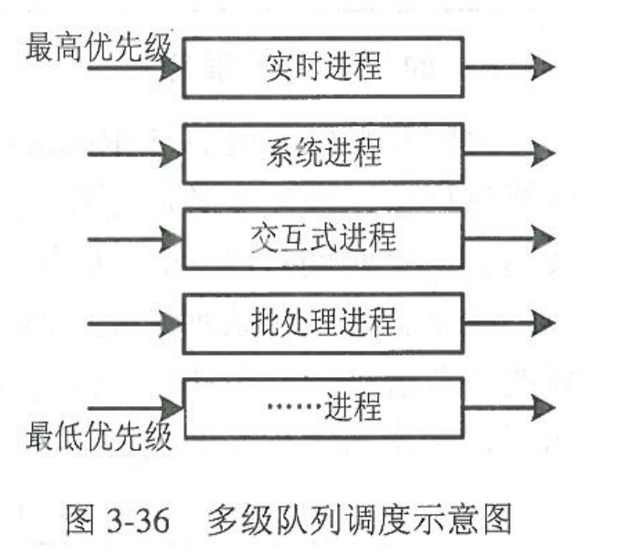</div> 
>7. 多级反馈队列调度算法：   
    基本思想：
    - 设置多个队列
    - 各队列内部按照时间片轮转算法进程调度
    - 各队列间采用抢占式优先级算法调度
>&nbsp; 
>### 3.5.3 Linux调度算法解析
>&nbsp; 
&nbsp; 
#  3.6 进程通信
>### 3.6.1 进程通信种类
>1. 共享存储器系统通信   
    在存储器中划出一块共享区域，然后映射到进程的虚拟地址空间中。
    特点：没有中间环节，通信速度快，能方便的交换大量数据。
>2. 消息传递系统通信   
    进程间的数据交换以格式化的信息为单位。程序员利用系统提供的一组通信原语对进程进行通信。   
    信息包括：消息头和正文。   
    消息头有：发送进程名，接收进程名，消息长度，消息类型，发送时间等。
>    - 直接通信方式：
    使用原语：send()/receive()   
    实现方式：
>        1. 阻塞发送，阻塞接收：发送进程和接收进程都被阻塞直到完成信息交付。
>        2. 无阻塞发送，无阻塞接收：通信双方没有同步需求。
>        3. 无阻塞发送，阻塞接收：发送进程发送消息后继续执行；接收进程被阻塞知道请求的消息到达。
>    - 间接通信方式：
    基本思想：发送进程把消息发送到一个共享的称之为信箱的中间实体中，接收进程从信箱中取出对方发送给自己的信息。信箱是一种数据结构。   
    分类：  
    私有信箱：用户进程自己创建，只有创建者能取消息，其他进程能发消息
    公用信箱：操作系统创建，系统中所有核准进程可用。  
    共享信箱：某进程创建，指明了共享者，创建者和共享者都可用。   
    信箱的结构分为信箱头和信箱体，如图3-41：
>       <div align=center>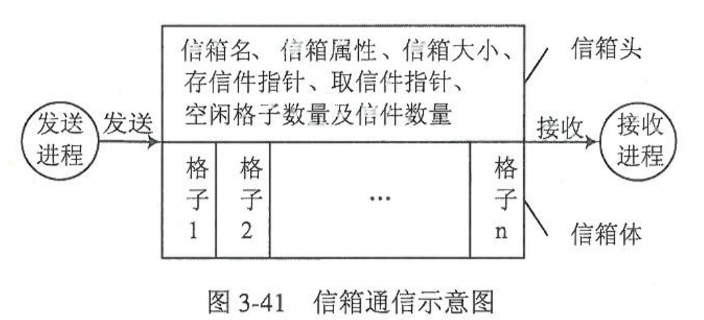</div> 
>3. 管道通信    
    所谓的管道是用于连接两个进程以实现他们之间进程通信的一个打开的共享文件。每个管道文件打开后都有两个文件描述符fd[0]和fd[1]，一个读一个写。管道以先进先出的方式组织数据的传输。
    实现机制：
>    - 无名管道：存在于缓存中的临时文件，没有对应的磁盘映像。
>    - 有名管道：可用于系统中任意进程间的通信。在文件系统中长期存在的具有路径名的文件。
    读和写需要互斥进行；当管道满了后，写需要阻塞，等待读后再写；只有确定双方都存在才能进入管道。
>4. 客户-服务器系统通信
>    - 套接字(Socket)
>    - 远程过程调用
>&nbsp; 
>### 3.6.2 消息缓冲队列通信机制
>思路：系统统一管理一组用于通信的空闲消息缓冲区；某进程要发送消息时，先在自己的地址空间中设置一个发送区，并将要发送的消息填入，再申请一个消息缓冲区，把数据从发送区复制到消息缓冲区，然后把消息缓冲区直接发送到接收进程的消息队列中；接收进程把自己的消息队列上取下消息缓冲区，并将其中的数据复制到自己的消息接收区中，最后释放消息缓冲区。
>1. 消息缓冲区队列通信机制中的数据结构：
>    - 消息缓冲区：  
>       ```C
>       typedef struct message_buf{
>        int sender;             //发送进程标识符
>        int size;               //消息长度
>        char *text;             //消息正文
>        time send_time;         //发送时间
>        struct message_buf next;//指向下一个消息缓冲区的指针
>        ...                     //其他所需消息
>       }
>    - 缓冲区队列：    
        没有被使用的缓冲区位于某个缓冲队列中。
>    - PCB中与同行有关的数据项：
>        ```C
>        typedef struct PCB{
>            ...
>            struct message_buf *mq;     //进程消息队列的队首指针
>            semaphore mutex;            //进程消息队列的互斥信号量
>            semaphore sm;               //进程消息队列资源信号量
>            ...
>        }
>        ```
>1. send()   
    send()原语一般需要完成：**1）** 向系统申请一个空闲的消息缓冲区。**2）** 将发送区a中的消息复制到该缓冲区中。**3）** 将缓冲区插入到接收进程的消息队列中。code:  
>    ```C
>    void send(recevier a){              //recevier是接收进程的标识符
>        getbuf(a.size,i);               //根据消息大小申请缓冲区，标号为i
>        copy(i,a);                      //将发送区a中的消息复制到缓冲区i中
>        recevier_pcb=getpcb(recevier);  //根据接收进程的标识符获取它的PCB
>        wait(recevier_pcb.mutex);       //获得接收进程的消息队列的使用权
>        insert(recevier_pcb.mq,i);      //将缓冲区i插入到接收进程的消息队列中
>        signal(recevier_pcb.mutex);     //释放接收进程的消息队列的使用权
>        signal(recevier_pcb.sm);        //接收进程消息队列中消息数+1
>    }
>    ```
>2. receive()   
    receive()原语一般需要完成：**1）** 首先从自己的消息队列中取出一个消息缓冲区。**2）** 把消息缓冲区中的消息复制到接收区b中。**3）** 释放消息缓冲区。code:   
>    ```C
>    void recevier(b){
>        wait(receive_pcb.sm);          //receive_pcb为接收进程的PCB
>        wait(receive_pcb.mutex);       
>        remove(receive_pcb.mq,j);      //取出接收进程的消息队列中的第一个消息j
>        signal(receive_pcb.mutex);
>        copy(b,j);                     //将消息缓冲区中的消息复制到接收区b中
>        releasebuf(j);                 //释放消息缓冲区
>    }
>    ```
>&nbsp; 
>### 3.6.3 Linux进程通信机制
>&nbsp; 
&nbsp; 
#  3.7 进程死锁
>### 3.7.1 死锁的基本概念
>1. 死锁的概念
进程间资源申请的冲突
>2. 产生原因
>    - 竞争资源
    系统的资源分为可重用资源和消耗性资源：可重用资源一次只能被一个进程使用，使用后不会减少。消耗性资源使用后会消失，如中断、信号等。  
    可重用资源又分为可剥夺资源和不可剥夺资源。可剥夺资源指状态可以被保存和恢复的资源，该类资源若分配给进程，系统可以强制收回，不会对进程造成有害影响，如CPU、主存。不可剥夺资源指该资源分配给进程后补鞥呢强制回收，只能等使用完毕，如文件、打印机、数据库等。多个进程对可剥夺资源的竞争不会引起死锁。**对不可剥夺资源的竞争会导致死锁。**
>    - 进程推进顺序不当
    如果两个进程、两个资源。当系统先将两个资源分给其中一个进程不会产生死锁。但每个进程各分配一个资源，则会导致死锁。
>3. 产生死锁的必要条件
    必须同时满足下面四个条件才会出现死锁：
>    - 互斥条件：资源某时段只能由一个进程使用。
>    - 占有且等待条件：等待新资源的时候，已经有部分资源。
>    - 不可剥夺条件：系统不能强行剥夺进程正在使用的资源。只能等待进程释放。
>    - 循环等待条件：多个进程各自有一些资源，又等待其他资源（等待的资源被占有）
>4. 处理死锁的基本方法
>    - 预防死锁：破坏产生死锁的四原因之一。容易实现，但限制了系统资源的分配，资源利用率低。
>    - 避免死锁：在资源分配的过程中，用某些方法防治系统进入不安全状态。
>    - 检测和解除死锁：设置死锁检测机构，出现死锁采用方法解除死锁。最大限度利用资源，实现难度大。
>&nbsp; 
>### 3.7.2 预防死锁
>1. 破坏占有且等待条件
    需要保证一个进程在申请资源的时候不能占有其他资源。
>    - 静态分配资源：进程在一开始的时候就申请到全部需要的资源，后期不申请。
    缺点：获得的资源可能很长时间不用；如果需要的资源多，则很难开始运行。
>    - 进程在不占有资源的时候才可以申请资源。
>2. 破坏不可剥夺条件
    一个进程占有资源的情况下申请资源，如果申请不到，则它的资源可以被别的进程占用。此方法适用于可剥夺资源（内存、处理器），不适合打印机、磁带机。
>3. 破坏循环等待条件
    按顺序分配资源：对系统的资源类型进行线性排序并编号，规定如果进程整个生命周期需要申请两个及以上的资源时，必须按序号递增顺序申请资源，如果进程需要多个同类型的资源，必须同时一起申请。   
>&nbsp; 
>### 3.7.3 避免死锁
>1. 安全状态   
    定义：设系统中有n个进程，若存在一个进程序列<P1,P2,,,Pn>。使得进程Pi(i=1,2,3,,)以后还需要的资源就可以通过系统现有的空闲资源加上所有的Pi(j<i)已占有的资源来满足。此时系统处于安全状态，进程序列<P1,P2,P3,,Pn>称为安全序列。（需要资源<现有空闲+已用资源）
>2. 银行家算法
>    - 算法中的数据结构
    n表示进程数，m表示资源种类的数目。  
    **可利用资源向量Available**:一个长度为m的向量，描述系统中每类资源当前可用数目，Available[j]=k，表示系统中第j类资源当前可用k个。  
    **最大需求矩阵Max**：是一个n*m的矩阵，描述每个进程在运行过程中对每个资源的最大需求量，Max[i][j]=k，表示进程Pi对Rj类资源的最大需求个数为k个。  
    **分配矩阵Allocation**：是一个n*m的矩阵，描述每个进程当前已经分配到的各类资源数量，Allocation[i][j]=k，表示进程Pi当前已经分配到k个Rj类资源。  
    **需求矩阵Need**:是一个n*m矩阵，描述各个进程对每类资源还需要的数量。Need[i][j]=k，表示进程Pi，还需要k个Rj类资源。  
    Need[i][j]=Max[i][j]-Allocation[i][j]
>    - 安全性算法  
    设置两个向量：工作向量Work，长度为m，描述系统某一时刻可以提供的各类资源的数量。布尔向量Finish，长度为n，描述系统是否有足够的资源分配给进程。    
    从进程集合中寻找同时满足一下两个条件的进程：Finish[i]=False,Need[i][j]<=Work[j]。  
    当Pi获取所需资源后，可顺利执行，直至释放占用的资源：Work+=Allocation[i]，Finish[i]=Ture。  
    如果对所有Finish[i]=Ture,则系统处于安全状态。
>&nbsp; 
>## 3.7.4 死锁的检测与解除
>1. 资源分配图
    一个有向图，圆圈表示进程，方框表示资源，框里的黑点表示此类资源数目。边：进程->资源，表示请求。资源->进程，表示占有。如图3-50：<div align=center>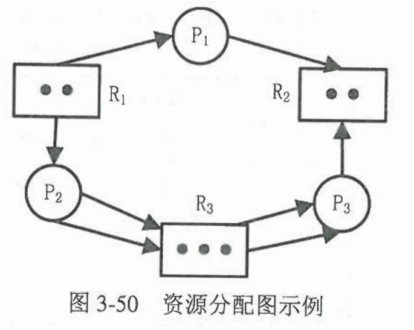</div> 
>2. 死锁定理
之后补充
>3. 死锁检测算法
之后补充
>4. 死锁检测时机  
    考虑因素：1）频繁程度；2）受死锁影响的进程数量；3）死锁检测系统开销  
    思路:1）每当进程请求资源得不到满足；2）周期性检测；3）根据CPU利用率检测。
>5. 死锁的解除    
    常用的做法是撤销一些死锁进程或者抢占部分死锁进程的资源。
>    - 撤销进程：
    撤销所有死锁进程
    一次只撤销一个死锁进程，知道解除死锁。
>    - 抢占资源：
    考虑问题：1）进程的优先级，交互性，已占有资源数等。2）回滚问题，会增加系统开销。3）避免饥饿现象。
>&nbsp; 
#  3.8 线程机制
>### 3.3.1 线程的基本概念
>1. 进程的引入  
    同一进程需要同时处理多个事务。如果采用多个进程处理会加大系统的开销。所以产生了线程。
>2. 什么是线程
    线程隶属于进程的一个实体。线程共享本进程的资源。此外，每个线程都有自己的：**1）** 一个线程ID。**2）** 一组寄存器集合：表示线程运行时处理器状态。**3）** 两个栈：用户栈，内核栈。**4）** 一个私有存储区，存放线程私有数据。**5）** 线程控制块TCB：存放线程的管理信息，如线程ID,寄存器的值，线程状态等。
>3. 线程与进程的比较  
>    - 调度：传统操作系统中，进程是资源分配和拥有的基本单位，又是独立调度和执行的基本单位。而引入线程后，线程是调度和执行的基本单位，进程还是资源分配和拥有的进本单位。
>    - 并发性：不仅进程间可以并发执行，一个进程中的多个线程也可以并发执行。
>    - 拥有资源：进程是拥有资源的独立单位，线程基本不拥有资源，但它可以访问进程的所有资源（代码段、数据段、文件、I/O）
>    - 系统开销：创建线程只需要为期建立堆栈和TCB。进程创建需要资源分配、建立虚拟空间、PCB。
>4. 线程管理
>    - 线程状态：
        就绪、运行、阻塞、终止
>    - 线程控制：    
        线程创建：分配设置TCB，创建堆栈，插入就绪队列。
        线程终止：线程自动运行完毕或者错误终止。
        线程阻塞：运行中需要等待。
        线程唤醒：阻塞中等待的已经完毕。
>    - 线程同步：
        [3.4.2](###342-进程同步机制及应用)进程同步算法适用于线程同步
>    - 线程调度：
        [3.5.2](###352-进程调度算法)进程调度算法适用于线程调度    
>&nbsp; 
>### 3.8.2 线程的实现机制
>&nbsp; 
>## 3.8.3 Linux线程机制
>&nbsp; 
>&nbsp; 
# 3.9 小结
<div align=center>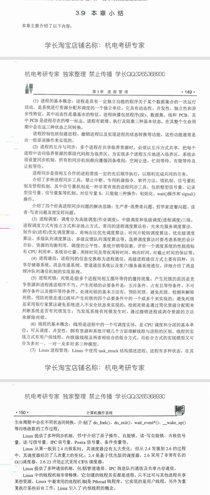</div> 