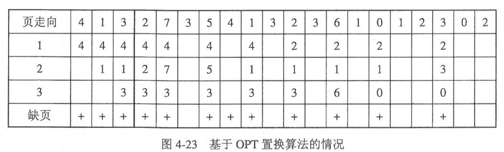

# 第四章 存储器管理  
--------   
- [4.1 存储器管理概述](#41-存储器管理概述)
    - [4.1.1 多级存储器体系](#411-多级存储器体系)
    - [4.1.2 存储器管理功能](#412-存储器管理功能)
    - [4.1.3 程序的装入和链接](#413-程序的装入和链接)
- [4.2 连续存储器管理方式](#42-连续存储器管理方式)
    - [4.2.1 固定分区方式](#421-固定分区方式)
    - [4.2.2 可变分区方式](#422-可变分区方式)
- [4.3 分页存储管理方式](#43-分页存储管理方式)
    - [4.3.1 分页存储管理基本原理](#431-分页存储管理基本原理)
    - [4.3.2 两级和多级页表](#432-两级和多级页表)
- [4.4 分段管理方式](#44-分段存储管理方式)
- [4.5 段页式存储管理方式](#45-段页式存储管理方式)
- [4.6 虚拟存储系统](#46-虚拟存储系统)
    - [4.6.1 虚拟存储器的基本概念](#461-虚拟存储器的基本概念)
    - [4.6.2 请求分页存储管理方式](#462-请求分页存储管理方式)
- [4.7 Linux内存管理机制](#47-linux内存管理机制)
    - [4.7.1 Linux地址映射机制](#471-linux地址映射机制)
    - [4.7.2 Linux物理内存空间管理](#472-linux物理内存空间管理)
    - [4.7.3 Linux虚拟地址空间管理](#473-linux虚拟地址空间管理)
- [4.8 本章小结](#48-本章小结)
--------  

# 4.1 存储器管理概述
>### 4.1.1 多级存储器体系
>    为了平衡容量、价格、性能之间的关系。
>&nbsp; 
>### 4.1.2 存储器管理功能
>    本章将的存储器仅限于内存。
>    1. 内存的分配和回收
        为进程分配所需要的内存空间，在使用完后回收空间。
        静态：在进程开始的时候分配好内存，后期不再分配。
        动态：进程在运行的过程中会动态的申请和释放空间。
>    2. 地址映射  
        编译器在对程序编译的时候，通常从0开始为代码编址，这种地址称为虚地址、相对地址或逻辑地址。程序加载到内存中的地址称为实地址、绝对地址或物理地址。从虚地址转化到实地址的功能称为映射（地址重定位）。
>    3. 内存的共享和保护
        多个进程访问某一段内存空间中的程序或数据，也是进程间的高级通信方式。
        内存保护是为了避免各进程之间相互干扰，对内存中各进程的程序和数据进行保护。
>    4. 内存扩充
        [虚拟存储器](#46-虚拟存储系统)
>&nbsp; 
>### 4.1.3 程序的装入和链接
>    用户写好的程序需要进过编译成若干目标模块，然后这些模块与需要的库模块进行链接，最后装入内存。  
>    根据链接工具进行的时机，链接方式有： 
>    1. 静态链接：程序在装入内存前就将目标模块与库模块链接成完整的可执行程序。
>    2. 装入时动态链接：程序在装入内存时，边装入边链接的。
>    3. 运行时动态链接：程序状装入内存时仍是目标模块，等执行到需要的模块或者库的时候才进行相应的链接。
> 根据地址映射进行的时机，装入方式有：
>    - 绝对装入：将程序加载到某一个指定定制开始的一段内存空间。
>    - 静态重定位装入：程序加载到内存中任一合适位置。
>    - 动态重定位装入：装入时目标模块使用逻辑地址，真正执行指令再将指令本身或者指令中操作数的逻辑地址转换成物理地址。
>&nbsp; 
&nbsp; 
# 4.2 连续存储器管理方式
>### 4.2.1 固定分区方式
>    将物理内存划分为大小和数量固定的若干分区。每个分区只能装入一个程序。其中固定分区又可以分为大小相同或不同的两种。
>&nbsp; 
>### 4.2.2 可变分区方式
>    可变分区的分区大小和数量都是可变化的。管理使用空闲分区链和相应的分配回收算法实现。
>    1. 分配算法
>        - 首次适应算法：空闲分区链按照从小到大的顺序链接。每次分配从第一个空闲区找，直到找到一个可以满足需求的分区。
>        - 最佳适应算法：从空闲分区链中找到一个和需求大小相近的空闲空间，进行分配。优点：最大限度的保留大的空闲分区。缺点：分区划分后留下的空间很小，容易形成外部碎片。
>        - 最坏适应算法：从空闲分区链中找到最大的空闲分区，进行分配。使剩下的空闲空间较大。
>    2. 回收算法
        在程序运行结束的时候，操作系统回收并标记相应分区为空闲空间。内存回收分为上邻接、下邻接、上下邻接和无邻接四种情况。回收后会根据相邻的空闲分区来重新标记空闲的分区位置和大小。
>        

>&nbsp; 
>&nbsp; 
# 4.3 分页存储管理方式
>### 4.3.1 分页存储管理基本原理
>1. 页与页框
    分页存储管理是指将物理空间和程序逻辑空间分成大小相等的块。在逻辑空间中的块称之为页面，物理空间的块称为物理块、页框、帧。
>2. 逻辑地址结构
    分页系统的逻辑地址结构包括两部分：页号P和页内地址d。
    在地址映射的时候根据给定的逻辑地址计算得到P，d。
>3. 页表
    在地址映射的时候需要知道页面对应的物理块，系统为每个进程设置了一张页号到物理块的映射表，称为页表，如图4-8。每项由页号P和块号组成。
    

    [例题4.4](../que/4_4.PNG)
>4. 地址映射与越界保护
    实际的地址映射并不进行计算，而是由图4-9所示的地址映射机构完成的。页表寄存器会判断页号是否超过长度。
    

    [例题4.5](../que/4_5.PNG)
>5. 快表
    快表中保存着部分的页表。如果快表没命中，则查找整个进程页面。（而且会更新快表）如图4-10
    

>&nbsp; 
>### 4.3.2 两级和多级页表
>   如果进程本身很大，就需要多级页表。二级页的结构为：外部页号P1，外部页内地址P2，和页内地址d。
    

>&nbsp; 
&nbsp; 
# 4.4 分段存储管理方式
>    分段存储管理方式将进程的虚地址空间按照逻辑信息划分为若干段，存储有逻辑关系和意义的部分，能够更容易的实现程序的更新和升级，数据的共享和保护。
>    1. 段
        分段存储管理方式也属于离散存储管理方式。 每个段都有一个字符串标识符和一个唯一编号，分别称为段名和段号；每个段都是从0开始连续编址，称为段内地址。
>    2. 逻辑地址结构
        高位为段号S，低位位段内地址d。d的位数决定了段的最大（不是段的长度），S决定了一个进程段的最大数量。
>    3. 段表
        每个分段占一个段表，每个表项由段号、段长和段基址构成。如图4-14    
        

>    4. 地址映射与越界保护
        类似分页管理。如图4-15  
        

>    5. 段共享与保护
        为实现段的共享，可在系统中配置一张共享段表，每个共享的段占用一个表项。表项纪录了共享段的段名、段长、内存始址、存在位（是否调入内存）、共享进程计数等信息。并纪录了共享此段的每个进程的情况。
>&nbsp; 
&nbsp; 
# 4.5 段页式存储管理方式
>段页式存储管理首先将进程按逻辑信息分为若干段，然后将每个段再按照系统规定的页面大小划分为若干页面。段页式逻辑地址结构分为三部分，段号S、段内页号P和页内地址d。如图4_16_17所示：
>    

>***有待补充***
>    

>    

>&nbsp; 
&nbsp; 
# 4.6 虚拟存储系统
>### 4.6.1 虚拟存储器的基本概念
>虚拟存储器指具有请求调入功能和置换功能，能够利用外存储器的空余空间从逻辑上对内存容量进行扩充的一种存储器系统。
>与无虚拟存储的区别：
>- 将进程装入的一次性改为多次性。
>- 将进程的驻留性改为置换性
当程序运行时，如果要访问的页面（段）已装入内存，则继续执行；如果要访问的页面（段）未装入内存，则发生缺页中断。此时，系统将启动**请求调页（段）功能** ，将作业需要的页（段）装入内存。如果内存已满，则调用页（段）置换功能，将内存中暂时不用的页（段）装入内存。
虚拟存储器的实现必须建立在离散存储器管理方式上，有三种实现方式：请求分页、请求分段、请求段页式。
>&nbsp; 
>### 4.6.2 请求分页存储管理方式
>1. 页表
    

    如图：
    状态位P：表示页面是否存在于内存，若不在则产生缺页中断。
    访问字段A：就页面被访问情况。
    修改位M：表示页面在装入内存后是否被修改过，供页面置换时参考。（外存上有内存上的副本）
    外存地址：记录页面在外存上的地址。
>2. 缺页中断机构
当所要访问的地址不在内存中时，地址映射机构产生缺页中断。图2-22是完整的流程：
    

>3. 地址映射机构
在分页系统的基础上增加了：缺页中断产生及处理、页面换出和换入功能。
>4. 抖动/颠簸(thrashing)
定义：当内存极度缺少的情况下，页面会频繁的换入、换出，就形成了抖动。解决思路：
>    - 如果是页面置换策略的失误，可以修改置换算法。
>    - 如果进程太多，则较少多道程序的数量。
>    - 终止发生抖动的进程
>    - 增加物理内存容量
>5. 工作集
指在某段时间间隔内，进程要访问的页面的集合。
原理：让操作系统跟踪每个进程的工作集，并为进程分配大于其工作集的物理块。如果还有空闲物理块，则再调一个进程到内存中。如果工作集之和超过了可用物理块的总数，则系统暂停些进程。
>6. 页面置换策略
    “可变”的是进程分配的内存物理块数量可以变化。”局部“指的是进程置换页面的时候之只能从本身已经在内存的页面中选择置换。*显然没有固定分配全局置换这种策略*
>    - 可变分配全局置换：物理块数量可变，可置换内存中所有的块。
>    - 可变分配局部置换：物理块数量可变，只能置换本进程内存中的块。
>    - 固定分配局部置换：物理块数量不可变，只能置换本进程内存中的块。
>7. 页面置换算法
    假设进程有三块物理块，页面访问走向：4、1、3、2、7、3、5、4、1、3、2、3、6、1、0、1、2、3、0、2.
>   - 最佳置换算法(Optimal,OPT)
   选择将来不再访问的页面或者最长时间内不会访问的页面进行淘汰。置换过程如图4-23：
    

   但实际上很难预测将来的页面走向。
>   - 先进先出置换算法(First In First Out,FIFO)
   淘汰最先调入内存的页面或者在内存中驻留最久的页面。置换过程如图4-24：
    

    优点是简单实现；缺点是没有考虑页面调入内存后被访问的情况。
>   - 最近最久未使用置换算法(Least Recent Used,LRU)
    淘汰最近一段时间内最长时间没有被访问的页面。置换过程如图4-25：
    

    想要快速的找出最近最久未被访问的页面，往往需要较多的硬件支持。
>   - 最近最少使用功能置换算法(Least Frequently Used,LFU)
   淘汰过去一段时间内访问次数最少的页面。LRU和LFU都是堆栈型算法，随着物理块增加，命中率会上升。FIFO算法基于队列实现，不是堆栈型置换算法。
>   - 时钟置换算法
>   - 页面缓冲思想
   在选中需要淘汰的页面后，并非立即淘汰出内存，而是让其在内存中暂时“缓冲”一段时间，如果该页面是错选的淘汰页面，进程又会很快的对其访问。
>&nbsp; 
&nbsp;  
# 4.7 Linux内存管理机制
>### 4.7.1 Linux地址映射机制
>### 4.7.2 Linux物理内存空间管理
>### 4.7.3 Linux虚拟地址空间管理
>&nbsp; 
&nbsp; 
# 4.8 本章小结 
>

